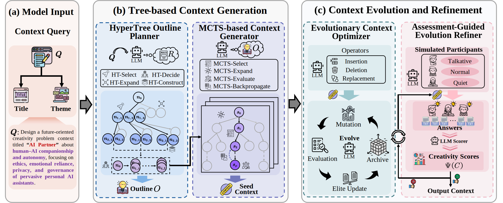

<div align="center">

# AlphaContext: An Evolutionary Tree-based Psychometric Context Generator for Creativity Assessment

**Yixuan Wang<sup>a</sup>, Yue Huang<sup>a</sup>, Hong Qian<sup>a, b, *</sup>, Yunzhao Wei<sup>a</sup>, Yifei Ding<sup>a</sup>, Wenkai Wang<sup>a</sup>, Zhi Liu<sup>a, b</sup>, Zhongjing Huang<sup>a</sup>, Aimin Zhou<sup>a, b</sup>and
Jiajun Guo<sup>a</sup>**<br>
<small>(*Corresponding authors)</small><br>
<sup>a</sup> East China Normal University, Shanghai, China<br>
<sup>b</sup> Shanghai Innovation Institute, Shanghai, China<br>

<a href='https://github.com/yxwang19/AlphaContext'></a>
<a href='paper/main.pdf'></a>


</div>
<!-- markdown break: force parser to end html block -->

🎉 Welcome to AlphaContext, this is a comprehensive repository specializing in
**AlphaContext: An Evolutionary Tree-based Psychometric Context Generator for Creativity Assessment** published in ACL 2026 main conference.

## 🔔 Abstract
Creativity has become a core competence in the era of LLMs and human–AI collaboration, underpinning innovation across real-world problem solving. Crucially, the systematic improvement of creativity necessitates scientifically valid assessment instruments. Psychometric research recognizes context-based assessment as an effective way to measure creative thinking. However, high quality expert-designed contexts remain scarce. Existing LLM-based generators often struggle with insufficient assessment cues, weak narrative coherence, limited stylistic diversity, and poor support for creative thinking. To address these challenges, we propose AlphaContext, an evolutionary tree-based psychometric context generator for creativity assessment. First, the HyperTree Outline Planner formalizes expert-designed outlining as a rule-guided hypertree and performs top-down hierarchical planning. The MCTS-based Context Generator fills the outline via MCTS to balance global structure and local quality. Then, the Evolutionary Context Optimizer evolves contexts with MAP-Elites by repeatedly updating niche elites to jointly improve diversity and quality. Finally, the Assessment-Guided Evolution Refiner simulates virtual participants with diverse styles and recycles weak contexts for further evolution. Experiments show that AlphaContext yields an average improvement of 8\% over competitive methods across 6 quality metrics.
## 🎓 Architecture
 <div align="center">


</div>
This paper proposes AlphaContext, an evolutionary tree-based psychometric context generator for creativity assessment. To tackle the first challenge, the HyperTree Outline Planner formalizes context outlining as a rule-guided hypertree, mapping expert reasoning into a searchable outline space. The MCTS-based Context Generator then performs Monte Carlo Tree Search (MCTS) generation under the outline, balancing global structural coherence and local semantic quality to produce seed contexts. To handle the second challenge, the Evolutionary Context Optimizer conducts evolutionary search with MAP-Elites in a task-specific behavioral space, iteratively expanding stylistic diversity via niche-wise elite updates. Finally, the Assessment-Guided Evolution Refiner simulates virtual participant responses and iteratively refines weak contexts to better elicit creative thinking.


---

## 🚀 Getting Started
To get started, create a new environment and install requirements via pip:
```bash
conda create -n AlphaContext python=3.9 -y
conda activate AlphaContext
python -m pip install -U pip
python -m pip install -r requirements.txt
```

Run the full pipeline:

```bash
python generate.py
```

By default, it reads inputs from `input/` and writes results to `outputs/`.

---

## 📝 Input

AlphaContext reads input from `input/test_dataset.json` by default.

The file should be a JSON array, and each item should contain:

- `title`: a short, human-readable name for the scenario
- `theme`: a short topic description that the system expands into a creativity-assessment context

For a quick test run, keep just one item in the array. For batch generation, include multiple items.

Example:

```json
[  
  { 
    "title": "AI Partner", 
    "theme": "Human–AI companionship and autonomy: ethics, emotional reliance, privacy, and governance of pervasive personal AI assistants." 
    },
  { 
    "title": "Ocean Soup Future Scene", 
    "theme": "Marine plastics futures: circular economy, cleanup tech, ecosystem impacts, and policy for ocean health." 
    }
]
```

Reference file: `input/test_dataset.json`

---

## 📦 Output

Most results are written to `outputs/` by default.

The main files to check are:

- `outputs/final_context_*.json`: per-sample final contexts
- `outputs/final_contexts/final_contexts_all.json`: merged final results
- `outputs/final_contexts_scored_*.json`: scored final contexts

Important intermediate artifacts may also appear in:

- `outputs/assembled_for_map_*.json`: MAP-Elites input files
- `outputs/map_elites_text_model_run/`: MAP-Elites run artifacts
- `modules/outputs/outline/`: outline files generated before full context expansion

---

## ⚙️ Model Configuration

All model-related settings are centralized in `model_config.py`. Before running the pipeline, make sure the model name, API base URL, and authentication settings match the endpoint you want to use.

For DeepSeek-style OpenAI-compatible endpoints, the main fields are:

- `MODEL_NAME_deepseek`: the model identifier used in requests, such as `deepseek-chat`
- `LITELLM_MODEL_NAME_deepseek`: the LiteLLM identifier for the same model, such as `deepseek/deepseek-chat`
- `API_BASE_deepseek`: the base URL of the model service, such as `https://api.deepseek.com`
- `API_KEY_deepseek`: the API key used to build the `Authorization: Bearer ...` header
- `CHAT_EP_deepseek`: the derived chat-completions endpoint
- `COMP_EP_deepseek`: the derived completions endpoint

Example configuration:

```python
MODEL_NAME_deepseek = "deepseek-chat"
LITELLM_MODEL_NAME_deepseek = f"deepseek/{MODEL_NAME_deepseek}"
API_BASE_deepseek = "https://api.deepseek.com"
API_KEY_deepseek = "sk-..."
CHAT_EP_deepseek = API_BASE_deepseek.rstrip("/") + "/chat/completions"
COMP_EP_deepseek = API_BASE_deepseek.rstrip("/") + "/completions"
```

If you prefer not to store secrets directly in the file, you can also provide the API key through the `DEEPSEEK_API_KEY` environment variable and keep the config file focused on endpoint settings.

In the terminal, set the environment variable before running the pipeline:

```bash
export DEEPSEEK_API_KEY="sk-..."
python generate.py
```

If you use this approach, you do not need to hard-code the key in `model_config.py`. Make sure `export DEEPSEEK_API_KEY="..."` and `python generate.py` are executed in the same terminal session.

## 💭 Reference 
Yixuan Wang, Yue Huang, Hong Qian, Yuezhao Wei, Yifei Ding, Wenkai Wang, Zhi Liu, Zhongjing Huang, Aimin Zhou and Jiajun Guo "AlphaContext: An Evolutionary Tree-based Psychometric Context Generator for Creativity Assessment." Proceedings of the 64th Annual Meeting of the Association for Computational Linguistics (ACL), 2026.

## Bibtex
```bibtex
@inproceedings{wang2026acl,
author = {Yixuan Wang, Yue Huang, Hong Qian, Yuezhao Wei, Yifei Ding, Wenkai Wang, Zhi Liu, Zhongjing Huang, Aimin Zhou and Jiajun Guo},
booktitle = {Proceedings of the 64th Annual Meeting of the Association for Computational Linguistics},
title = {AlphaContext: An Evolutionary Tree-based Psychometric Context Generator for Creativity Assessment},
year = {2026},
address={San Diego, CA, USA}
}
